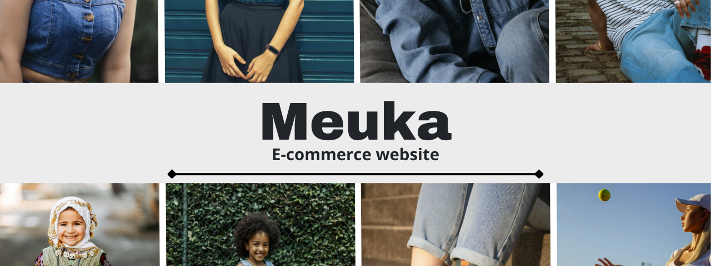

# Meuka - e-commerce clothes store 

Meuka is a full-stack Ecommerce WebApp with a sleek interface. It features robust and secure authentication system, API-based interconnection, and structured product data management leveraging the power of the MERN stack. Built for scalability and immediate performance. Meuka provides a comprehensive simulation of real-life internet store.

[Demo](https://meuka.janpabisiak.com)

## Features

-   Product Categories: Offers a variety of categories, including Women, Men, and Kids, for better navigation and personalization.
-   Product Showcase: Displays products with essential details such as names, prices, and images in a clean grid layout.
-   Product Page: Provides detailed information about each product, including available colors, sizes, and a clear call-to-action with an "Add to cart" button.
-   Cart Management: Allows users to easily add and delete products with selected colors and sizes.
-   Order history: Quickly find your previous orders with details.
-   API: Because of API it is easily to build another user interface and interact with current system.

## Tech Stack

## License

This project is licensed under the MIT License - see the [LICENSE](https://github.com/janpabisiak/Meuka/blob/main/LICENSE) file for details.
